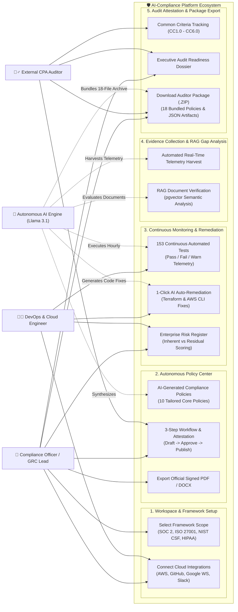
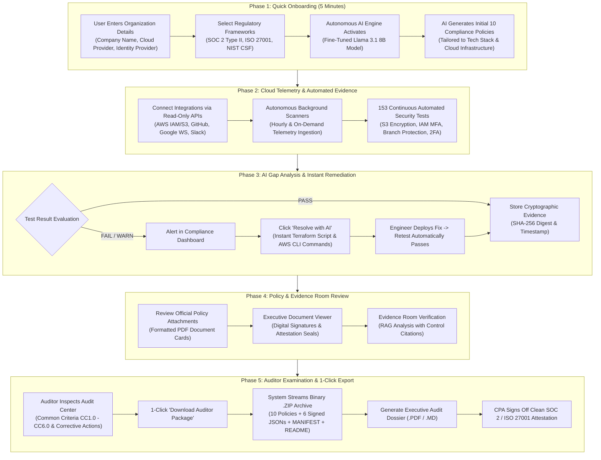

# AI-Compliance Platform: Product Architecture, Use Cases & End-to-End Flow

**Document Version:** 1.0  
**Target Audience:** Customers, Leadership, Compliance Officers, DevOps Engineers, and Auditors  
**Scope:** Multi-Framework Automated GRC (SOC 2 Type II, ISO/IEC 27001:2022, NIST CSF v2.0, HIPAA, GDPR)

---

## 1. Executive Summary

**AI-Compliance** is an enterprise autonomous Governance, Risk, and Compliance (GRC) platform. Traditional compliance audits require 6 to 12 months of manual consultant interviews, spreadsheet trackers, and repetitive screenshot collection. 

AI-Compliance transforms this process into a **continuous, automated, AI-driven workflow**:
1. **Zero Third-Party LLM Data Leakage:** Powered by an air-gapped, local fine-tuned **Meta Llama 3.1 8B Instruct** model running on sovereign infrastructure.
2. **Real-Time Telemetry Harvesting:** Direct read-only connectors to AWS, GitHub, Google Workspace, and Slack eliminate manual evidence gathering.
3. **153 Continuous Programmatic Tests:** Evaluates security posture 24/7 and generates instant 1-click **Terraform** and **AWS CLI** remediation code for failing controls.
4. **Scrut-Style Official PDF Artifacts:** Generates formal compliance policies and evidence dossiers styled with corporate letterheads, version history, and cryptographic sign-off seals.
5. **1-Click Auditor Package (.ZIP):** Packages 10 policies, 6 signed telemetry evidence JSONs, `MANIFEST.json`, and auditor `README.md` into an instant binary archive for CPA sign-off.

---

## 2. Product Use Case Diagram

---

## 3. End-to-End Product Flowchart

---

## 4. User Journey: Step-by-Step Breakdown

### Step 1: Onboarding & Instant AI Policy Generation
1. The user logs into `/onboarding` and selects their company profile (e.g. Acme Corp), infrastructure (`AWS`), identity provider (`Okta`), and version control (`GitHub`).
2. Selects target compliance frameworks (**SOC 2 Type II, ISO/IEC 27001:2022, NIST CSF v2.0**).
3. The platform invokes the local fine-tuned **Llama 3.1 8B** model, which writes 10 customized compliance policies:
   - Information Security (IS) Policy
   - Access Control & Identity Management Policy
   - Incident Response & Disaster Recovery Plan
   - Data Classification & Handling Policy
   - Mobile Device & Teleworking (MDM) Policy
   - Threat Intelligence & Vulnerability Management Policy
   - Vendor & Third-Party Risk Management Policy
   - Business Continuity Plan (BCP)
   - Change Management Policy
   - Encryption and Key Management Policy
4. Policies appear in `/policies` as official PDF document cards with version tags, approval steps, and corporate letterheads.

### Step 2: Zero-Touch Telemetry Ingestion
1. Under `/integrations`, the user connects external systems with read-only permissions:
   - **AWS Cloud:** Evaluates S3 bucket encryption, KMS key policies, IAM password policies, and security groups.
   - **GitHub:** Checks branch protection on main repositories, mandatory peer PR review counts, and commit signature requirements.
   - **Google Workspace:** Verifies 2FA enforcement across accounts, offboarding de-provisioning, and public drive sharing restrictions.
   - **Slack:** Audits message retention periods, DLP settings, and dedicated `#incident-response` channels.
2. Ingestion runs continuously in the background on an hourly schedule or immediately via **"Run Live Audit Scan"**.

### Step 3: Continuous Monitoring & AI Auto-Remediation
1. The platform executes **153 continuous automated tests** accessible on `/tests`.
2. Telemetry results are categorized into `PASSED`, `WARNING`, and `FAILED`.
3. If an issue is flagged (e.g., IAM users without MFA active):
   - The engineer clicks **"Resolve with AI"**.
   - A modal provides step-by-step remediation:
     - **Live Inspection:** View the flagged accounts and risk impact.
     - **AI Terraform Fix:** Copy-paste ready-to-apply Infrastructure-as-Code.
     - **AWS CLI Command:** 1-line shell script to immediately patch the vulnerability.
   - Once executed, the continuous scanner re-evaluates the environment and flips the test to `PASSED`.

### Step 4: Auditor Attestation & 1-Click Package Export
1. The external CPA auditor (e.g. KPMG, PwC, EY, BSI) accesses `/audits` to inspect:
   - **Common Criteria Mapping:** `CC1.0` (Control Environment) through `CC6.0` (Logical Access).
   - **Readiness Bars:** Separate progress meters for Policies (100%), Automated Tests (92%), and Evidence Artifacts (84%).
   - **Corrective Action Plan:** Non-conformity tracking with criticality, assignees, and deadlines.
2. The user clicks **"Download Auditor Package (.ZIP)"** on `/export`:
   - Streams an instant binary archive: `Acme_Corp_SOC2_Auditor_Package.zip`.
   - Contains **18 verified files**: 10 Markdown/PDF policies, 6 live telemetry JSON evidence files, `MANIFEST.json`, and auditor `README.md`.
3. The user downloads the **Executive Audit Dossier (.PDF)**.
4. The auditor certifies clean compliance attestation.

---

## 5. Technology Stack & Local AI Architecture

| Component | Technology | Purpose |
| :--- | :--- | :--- |
| **Frontend Web App** | Next.js 15 (App Router), React 19, Tailwind CSS, Lucide | Modern Scrut-style compliance cockpit, interactive terminal drawers, and PDF viewer. |
| **API & Enterprise Layer** | NestJS, TypeScript, Prisma ORM | Business logic, organization governance, JWT auth, and test-once-comply-many measures. |
| **AI & Telemetry Engine** | Python 3.11+, FastAPI, Uvicorn (Port 8000) | Local fine-tuned LLM inference, RAG gap analysis, cloud collectors, and binary ZIP generation. |
| **Open-Source LLM** | Meta Llama 3.1 8B Instruct (Fine-Tuned GRC) | Air-gapped, host-local policy generation and remediation without OpenAI or external API fees. |
| **RAG Vector Engine** | pgvector / Embeddings Service | Semantic search against control requirements and evidence documents. |
| **Document Engine** | Client-Side PDF-1.4 Generator (`pdfGenerator.ts`) | Generates genuine binary `.pdf` documents and print layouts directly in the browser. |

---

## 6. Accessing & Running the Platform

- **Dashboard:** `http://localhost:3000/dashboard`
- **Policies:** `http://localhost:3000/policies`
- **Automated Tests:** `http://localhost:3000/tests`
- **Integrations:** `http://localhost:3000/integrations`
- **Audit Center:** `http://localhost:3000/audits`
- **Auditor Export (.ZIP):** `http://localhost:3000/export`
- **FastAPI AI Docs:** `http://localhost:8000/docs`
