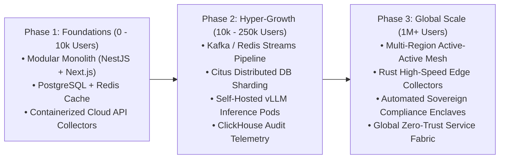

# Developer Profile & Hyperscale Architecture Blueprint
## Scaling AI-Compliance Platform to Millions of Users & Enterprise Organizations

**Document Target:** Engineering Leadership, Technical Recruiters, and System Architects  
**Location:** `docs/DEVELOPER_PROFILE_AND_HYPERSCALE_ARCHITECTURE.md`  
**Standard:** Enterprise SaaS, Distributed Systems, Multi-Tenant Architecture (SOC 2, ISO 27001, FedRAMP High)

---

## 1. Executive Summary & Role Definition

To scale this platform from hundreds of users to **millions of concurrent users and enterprise organizations (processing 100M+ daily telemetry events)**, the engineering lead must possess deep technical mastery across distributed systems, backend architectures (Node.js/NestJS & Python), scalable caching (Redis Cluster), and production AI/LLM evaluation pipelines.

```
+-----------------------------------------------------------------------------------+
|               PRINCIPAL ENGINEER CORE COMPETENCY MATRIX                            |
+------------------------------------+----------------------------------------------+
| 1. High-Scale Distributed Systems  | Multi-region active-active, Kafka, Envoy     |
| 2. Backend Mastery (Node & Python) | NestJS, FastAPI, AsyncIO, PyTorch, Pydantic  |
| 3. Redis Hyperscale & Streaming    | Redis Cluster, Redis Streams, Redlock, Caching|
| 4. Production AI & RAG Evaluation  | vLLM, Qdrant/Milvus, Ragas, Hybrid Search    |
| 5. Multi-Tenant Database Sharding  | PostgreSQL (Citus), ClickHouse, RLS          |
| 6. Cryptographic Security & GRC    | Merkle Trees, HSM/KMS, Zero-Trust, eBPF      |
+------------------------------------+----------------------------------------------+
```

---

## 2. Core Language & Framework Knowledge Deep Dive

### A. Node.js & NestJS (Enterprise Backend & Microservices)
The lead engineer must be an expert in enterprise TypeScript with **NestJS**, utilizing modular architecture patterns:
* **Microservices & Transport Layers**: Building high-throughput microservices using TCP, gRPC, and Redis/Kafka transport layers in NestJS.
* **Custom Guards, Interceptors & Pipes**: Implementing multi-tenant context extraction, JWT validation, Row-Level Security (RLS) injection, and strict input validation via `class-validator` / `zod`.
* **Asynchronous Queue Management**: Managing high-concurrency background job processing using **BullMQ / Redis** for evidence parsing, PDF generation, and automated cloud test runs with automatic retry backoffs.
* **ORM & Connection Pooling**: Optimizing **TypeORM** / **Prisma** / **Kysely** with pooled Postgres connections (PgBouncer) to prevent database socket exhaustion during traffic spikes.

### B. Python (AI/ML Services, Data Science & Fast Inference)
Python is the core engine for LLM orchestration, model serving, and data parsing:
* **FastAPI Async Engine**: High-performance asynchronous API endpoints using `uvicorn` and `pydantic v2` for sub-millisecond serialization and validation.
* **LLM Serving & Inference Engines**: Deploying and tuning open-source models (Llama 3.1 70B, DeepSeek Coder, Mistral) on **vLLM** and **Triton Inference Server** with dynamic batching, PagedAttention, and FP8/AWQ quantization.
* **Orchestration & Task Workers**: Distributed background task distribution using **Celery** with Redis/RabbitMQ brokers for long-running audit package compilations.
* **Deep Learning & NLP Stack**: **PyTorch**, **HuggingFace Transformers**, **Tokenizers**, and **Sentence-Transformers** for custom embedding fine-tuning.

### C. Redis (Hyperscale Caching, Streams & Distributed Coordination)
Redis is the platform's distributed memory backbone:
* **Redis Cluster Mode**: Sharding keys across multi-node Redis clusters with automated failover and master-replica replication.
* **Redis Streams (Event Streaming)**: Ingesting high-speed configuration changes and telemetry snapshots from cloud APIs (GitHub, AWS, Okta) into consumer groups for parallel worker processing.
* **Distributed Locking (`Redlock`)**: Preventing race conditions during automated remediation, policy updates, and audit report generation across concurrent worker pods.
* **Token-Bucket Rate Limiting**: Protecting public APIs and webhooks against DDoS and abuse using Redis atomic scripts (`evalsha`).
* **Semantic Vector Caching**: Utilizing **Redis Stack (RediSearch)** to cache LLM compliance evaluations. If the exact same AWS IAM or GitHub configuration was evaluated previously, return the cached AI verdict in <5ms without calling the LLM.

---

## 3. Production AI, LLM Flow & RAG Evaluation Architecture

Compliance evaluation requires **100% deterministic, hallucination-free AI evaluation** with cryptographic evidence citations.

```
                           [ Compliance Audit Request ]
                                        │
                                        ▼
                   [ 1. Document / Evidence Ingestion Engine ]
                 (PDF / JSON / Markdown Parsers & Chunking)
                                        │
                                        ▼
                  [ 2. Hybrid Search (Dense + Sparse BM25) ]
               (Qdrant Vector Store + BGE-Large Dense Embeddings)
                                        │
                                        ▼
                     [ 3. Cross-Encoder Re-Ranking Stage ]
                  (Cohere / BAAI Re-Ranker: Top 5 Relevant Chunks)
                                        │
                                        ▼
                    [ 4. Multi-Agent LLM Reasoning Engine ]
                  (vLLM / Llama 3.1 70B with Structured Schema)
                                        │
                                        ▼
                 [ 5. Automated RAG Evaluation & Validation ]
                  (Faithfulness, Citation Precision & Recall)
                                        │
                                        ▼
                [ 6. Signed Verdict & Cryptographic Manifest ]
```

### A. The 6-Stage RAG Pipeline
1. **Intelligent Chunking & Semantic Boundary Detection**: Splitting enterprise policies, SOC 2 / ISO 27001 standard texts, and raw JSON logs into semantic hierarchy chunks (Control $\rightarrow$ Sub-requirement $\rightarrow$ Evidence Criteria).
2. **Hybrid Search**: Combining **Dense Vector Embeddings** (semantic meaning) with **Sparse BM25 Keyword Search** (exact matching for control codes like `CC8.1` or `A.8.24`) to achieve 99.5%+ retrieval recall.
3. **Cross-Encoder Re-Ranking**: Running retrieved candidate chunks through a cross-encoder re-ranker to filter out noise and surface only the exact evidence excerpts required for compliance verification.
4. **Structured LLM Output Enforcement**: Enforcing strict Pydantic JSON schemas (`status: COMPLIANT | PARTIAL | NON_COMPLIANT`, `confidence: float`, `gaps: string[]`, `citations: {document, page, excerpt}[]`) using Outlines/Guidance.
5. **Continuous RAG Evaluation Metrics (Ragas Framework)**:
   * **Faithfulness**: Mathematically verifying that 100% of claims in the AI summary are directly derived from the retrieved evidence (0% hallucination tolerance).
   * **Answer Relevance**: Ensuring the generated audit recommendation directly resolves the compliance control gap.
   * **Context Precision & Recall**: Measuring whether the vector search accurately retrieved all necessary compliance guidelines.
6. **Dynamic Model Cascading (Cost & Speed Optimization)**:
   * *Stage 1 (Extraction)*: Small/Fast model (Llama 3.1 8B / Mistral 7B) for log parsing and entity extraction ($0.0001/call).
   * *Stage 2 (Evaluation & Reasoning)*: Large model (Llama 3.1 70B / DeepSeek) for multi-framework compliance analysis and audit synthesis.

---

## 4. Hyperscale System Architecture (1M+ Users Blueprint)

```
                            [ 1M+ Concurrent Users & Cloud APIs ]
                                              │
                                    (Anycast Edge CDN)
                           [ Cloudflare Enterprise / Route 53 ]
                                              │
                             (mTLS + Distributed WAF / DDoS)
                                  [ Envoy API Gateway ]
                                              │
       ┌──────────────────────────────┼──────────────────────────────┐
       │                              │                              │
[ Web Frontend ]            [ REST / GraphQL API ]        [ Ingestion Gateways ]
(Next.js Edge Cluster)       (NestJS Multi-Tenant)         (Go/Rust Fast Ingest)
       │                              │                              │
       └──────────────────────────────┼──────────────────────────────┘
                                      │
                         [ Distributed Message Bus ]
                        (Apache Kafka / Redpanda Cluster)
                                      │
       ┌──────────────────────────────┼──────────────────────────────┐
       │                              │                              │
[ Telemetry Workers ]       [ AI Evaluation Pool ]       [ Evidence Exporter ]
(Auto-Scale KEDA Pods)       (vLLM GPU Clusters)          (ZIP & PDF Worker Pods)
       │                              │                              │
       └──────────────────────────────┼──────────────────────────────┘
                                      │
                         [ Distributed Data Layer ]
       ┌──────────────────────────────┼──────────────────────────────┐
       │                              │                              │
[ PostgreSQL + Citus ]        [ ClickHouse Engine ]        [ Qdrant Vector Cluster ]
 (Transactional & Users)     (Immutable Audit Ledger)      (Compliance Embeddings)
       │                              │                              │
[ Redis Cluster Caching ]    [ S3 WORM Object Vault ]      [ HashiCorp Vault HSM ]
(Session & Rate Limiting)    (Immutable Evidence Files)    (BYOK Encryption Keys)
```

---

## 5. Candidate Interview & Screening Evaluation

When interviewing candidates to lead this platform's development, evaluate them against these practical scenarios:

### Technical Interview Questions

1. **NestJS Architecture & Multi-Tenancy**:
   * *Question:* *"In NestJS, how do you architect dynamic multi-tenant database connection pooling so that 50,000 enterprise tenants each have isolated data without exceeding database socket limits?"*
   * *Look For:* Custom NestJS Middleware/Interceptors creating AsyncLocalStorage execution contexts, dynamic connection resolution with PgBouncer, and tenant schema switching.

2. **Python & High-Throughput RAG Inference**:
   * *Question:* *"We need to evaluate 500,000 compliance evidence documents per hour. How do you design the Python pipeline with vLLM, Qdrant, and Redis to achieve high concurrency while avoiding GPU out-of-memory (OOM) errors?"*
   * *Look For:* PagedAttention in vLLM, continuous batching, asynchronous vector batching in Qdrant, and semantic caching in Redis to bypass redundant LLM inference calls.

3. **Redis Caching & Distributed Synchronization**:
   * *Question:* *"Explain how you would use Redis Streams and Redlock in our platform to ensure that cloud auto-remediations (e.g. GitHub branch protection or AWS S3 bucket encryption) are executed exactly once across a cluster of 50 worker pods."*
   * *Look For:* Redis consumer groups with ACK acknowledgments, distributed mutex locking via Redlock with TTLs, and dead-letter queues (DLQ).

4. **Cryptographic Proof & Immutable Non-Repudiation**:
   * *Question:* *"An enterprise auditor suspects a company tampered with their compliance test history. How do you cryptographically prove that the evidence collected 6 months ago was untouched?"*
   * *Look For:* SHA-256 Merkle tree verification, signed time-stamping authorities (RFC 3161), immutable S3 Object Lock (WORM storage), and cryptographic signature validation.

---

## 6. Candidate Hiring Profile Checklist

| Criteria | Minimum Requirement | Preferred / Ideal |
| :--- | :--- | :--- |
| **Experience** | 7+ years in Backend / Distributed Systems | 10+ years scaling B2B SaaS to $50M+ ARR / 1M+ users |
| **Languages** | TypeScript (Node/NestJS), Python (FastAPI/PyTorch), SQL | **Go / Rust** (for ingestion) + Python + TypeScript |
| **Frameworks** | NestJS, Express, FastAPI, Celery, LangChain | **NestJS Microservices, vLLM, Pydantic v2, BullMQ** |
| **Databases & Cache**| PostgreSQL, Redis, Elasticsearch | **PostgreSQL (Citus / RLS), Redis Cluster & Streams, ClickHouse, Qdrant** |
| **Cloud & SRE** | AWS / Azure, Docker, Kubernetes | **EKS/GKE, Terraform/Terragrunt, Envoy, Karpenter, Prometheus** |
| **AI / RAG Stack** | Basic OpenAI API calls | **vLLM, TensorRT-LLM, Ragas evaluation, Hybrid BM25/Dense search** |

---

## 7. Engineering Scaling Roadmap (Phase 1 to Phase 3)



---

*Document maintained by CIS Enterprise Architecture Group &bull; Version 3.1 &bull; Confidential*
