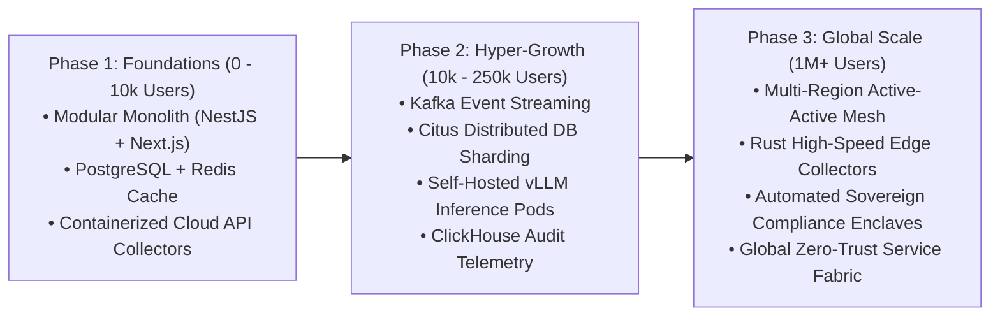

# Developer Profile & Hyperscale Architecture Blueprint
## Scaling AI-Compliance Platform to Millions of Users & Enterprise Organizations

**Document Target:** Engineering Leadership, Technical Recruiters, and System Architects  
**Location:** `docs/DEVELOPER_PROFILE_AND_HYPERSCALE_ARCHITECTURE.md`  
**Standard:** Enterprise SaaS, Distributed Systems, Multi-Tenant Architecture (SOC 2, ISO 27001, FedRAMP High)

---

## 1. Executive Summary & Role Definition

To scale this platform from hundreds of users to **millions of concurrent users and enterprise organizations (processing 100M+ daily telemetry events)**, the engineering lead must not be a generic web developer. 

The ideal candidate is a **Principal / Staff Distributed Systems & AI Platform Architect** with proven expertise in high-throughput event streaming, multi-tenant database isolation, self-hosted LLM inference pipelines, and enterprise-grade security engineering.

```
+-----------------------------------------------------------------------------------+
|               PRINCIPAL ENGINEER CORE COMPETENCY MATRIX                            |
+------------------------------------+----------------------------------------------+
| 1. High-Scale Distributed Systems  | Multi-region active-active, Kafka, Envoy     |
| 2. Multi-Tenant Database Sharding  | PostgreSQL (Citus), ClickHouse, Redis Cluster|
| 3. Production AI & RAG Pipelines   | vLLM, Triton Inference, Qdrant/Milvus, Llama |
| 4. Cryptographic Security & GRC    | Merkle Trees, HSM/KMS, Zero-Trust, eBPF      |
| 5. Cloud & SRE Hyperscaling        | Kubernetes (EKS/GKE), Terraform, OpenTelemetry|
+------------------------------------+----------------------------------------------+
```

---

## 2. Core Knowledge & Technical Skills Required

### A. High-Throughput Distributed Architecture & Multi-Tenancy
* **Multi-Tenant Data Isolation**: Deep understanding of multi-tenancy models (Shared Process / Separate Schema vs. Row-Level Security `RLS` with tenant token hashing vs. Dedicated DB pods for Fortune 500 banks/MNOs).
* **Event-Driven Ingestion Pipelines**: Building streaming ingestion pipelines using **Apache Kafka**, **Redpanda**, or **AWS Kinesis** capable of handling **50,000+ telemetry snapshots/sec** without dropping packets.
* **Distributed Task Scheduling**: Managing distributed job orchestration using **Temporal.io**, **BullMQ**, or **Celery** with idempotency guarantees and exponential backoff retry policies.

### B. High-Scale Database & Storage Engineering
* **Relational Sharding**: Advanced PostgreSQL tuning, connection pooling (**PgBouncer** / **Supavisor**), write-ahead logging (WAL), and distributed sharding using **Citus Data** or **CockroachDB**.
* **Time-Series & Audit Log Engines**: Utilizing **ClickHouse** or **TimescaleDB** for immutable, high-speed storage and aggregation of billions of telemetry records with sub-second query latency.
* **Distributed Caching**: Multi-layer caching strategy with **Redis Cluster** (Cluster Mode Enabled), cache invalidation patterns (Write-through, Cache-aside), and distributed locks (`Redlock`).

### C. Enterprise AI/LLM & RAG Pipeline Optimization
* **High-Throughput Inference Engines**: Deploying and tuning self-hosted open-source LLMs (Llama 3.1 70B, DeepSeek Coder, Mistral) on **vLLM**, **TGI (Text Generation Inference)**, or **NVIDIA Triton Inference Server** with dynamic batching, PagedAttention, and FP8/AWQ quantization.
* **Scalable Vector Search**: Indexing millions of compliance documents in distributed vector databases (**Qdrant**, **Milvus**, or **pgvector on Citus**) using HNSW indexing and semantic caching to prevent redundant LLM invocations.
* **Deterministic Guardrails & Structured Output**: Enforcing schema adherence (JSON Schema / Pydantic) with Outlines / Guidance to guarantee 100% syntactically valid compliance reports.

### D. Cryptographic Integrity & Data Sovereignty
* **Immutable Audit Trails**: Building cryptographic **Merkle Trees** and tamper-evident ledgers for compliance evidence and configuration logs.
* **Envelope Encryption & Key Management**: Utilizing **AWS KMS**, **HashiCorp Vault**, or **Cloud HSM** to encrypt tenant data at rest using customer-managed keys (BYOK - Bring Your Own Key).
* **Data Sovereignty Controls**: Routing and pinning tenant telemetry data to regional sovereign clusters (e.g. EU data in Frankfurt, African telecom data in Zambia/South Africa).

### E. Cloud Infrastructure, Kubernetes & SRE
* **Container Orchestration**: Production **Kubernetes (EKS / GKE)** with Horizontal Pod Autoscaling (HPA), KEDA (Kubernetes Event-driven Autoscaling), and node auto-provisioning (**Karpenter**).
* **Service Mesh & Traffic Engineering**: **Istio** or **Envoy Gateway** for mTLS encryption, canary deployments, rate limiting (Token Bucket / Leaky Bucket), and circuit breaking.
* **Full-Stack Observability**: Distributed tracing, metrics, and log aggregation using **OpenTelemetry**, **Prometheus**, **Grafana**, and **Loki**.

---

## 3. Hyperscale System Architecture (1M+ Users Blueprint)

```
                            [ 1M+ Concurrent Users & Cloud APIs ]
                                              │
                                    (Anycast Edge CDN)
                           [ Cloudflare Enterprise / Route 53 ]
                                              │
                             (mTLS + Distributed WAF / DDoS)
                                  [ Envoy API Gateway ]
                                              │
       ┌──────────────────────────────┼──────────────────────────────┐
       │                              │                              │
[ Web Frontend ]            [ REST / GraphQL API ]        [ Ingestion Gateways ]
(Next.js Edge Cluster)       (NestJS Multi-Tenant)         (Go/Rust Fast Ingest)
       │                              │                              │
       └──────────────────────────────┼──────────────────────────────┘
                                      │
                         [ Distributed Message Bus ]
                        (Apache Kafka / Redpanda Cluster)
                                      │
       ┌──────────────────────────────┼──────────────────────────────┐
       │                              │                              │
[ Telemetry Workers ]       [ AI Evaluation Pool ]       [ Evidence Exporter ]
(Auto-Scale KEDA Pods)       (vLLM GPU Clusters)          (ZIP & PDF Worker Pods)
       │                              │                              │
       └──────────────────────────────┼──────────────────────────────┘
                                      │
                         [ Distributed Data Layer ]
       ┌──────────────────────────────┼──────────────────────────────┐
       │                              │                              │
[ PostgreSQL + Citus ]        [ ClickHouse Engine ]        [ Qdrant Vector Cluster ]
 (Transactional & Users)     (Immutable Audit Ledger)      (Compliance Embeddings)
       │                              │                              │
[ Redis Cluster Caching ]    [ S3 WORM Object Vault ]      [ HashiCorp Vault HSM ]
(Session & Rate Limiting)    (Immutable Evidence Files)    (BYOK Encryption Keys)
```

---

## 4. Candidate Interview & Screening Evaluation

When interviewing candidates to lead this platform's development, evaluate them against these practical scenarios:

### Technical Interview Questions

1. **Multi-Tenancy & Sharding at Scale**:
   * *Question:* *"We have 100,000 companies, each generating 500 configuration checks every hour. How would you design the PostgreSQL database schema and sharding strategy to ensure zero data leakage between tenants while keeping queries under 50ms?"*
   * *Look For:* Discussion of Tenant ID partitioning, Citus distributed tables, Row-Level Security (RLS), connection pooling with PgBouncer, and separating operational data from time-series telemetry.

2. **AI Inference Cost & Latency Optimization**:
   * *Question:* *"Calling OpenAI APIs for 10 million automated evidence evaluations per day is financially impossible. How would you architect a self-hosted inference cluster with open-source LLMs to achieve sub-200ms latency and high concurrency?"*
   * *Look For:* Mentioning vLLM / Triton, PagedAttention, continuous batching, quantized weights (FP8/AWQ), semantic vector caching, and fallback queues.

3. **Cryptographic Proof & Immutable Non-Repudiation**:
   * *Question:* *"An enterprise auditor suspects a company tampered with their compliance test history. How do you cryptographically prove that the evidence collected 6 months ago was untouched?"*
   * *Look For:* SHA-256 Merkle tree verification, signed time-stamping authorities (RFC 3161), immutable S3 Object Lock (WORM storage), and cryptographic signature validation.

4. **Zero-Downtime Migration & Scaling**:
   * *Question:* *"How do you handle schema migrations across thousands of sharded tenant databases during peak traffic without locking tables or dropping API calls?"*
   * *Look For:* Blue-green deployments, backward-compatible dual-writing, gh-ost / pg_repack zero-downtime schema migrations, and feature flags.

---

## 5. Candidate Hiring Profile Checklist

| Criteria | Minimum Requirement | Preferred / Ideal |
| :--- | :--- | :--- |
| **Experience** | 7+ years in Backend / Distributed Systems | 10+ years scaling B2B SaaS to $50M+ ARR / 1M+ users |
| **Languages** | TypeScript (Node/Nest), Python (FastAPI/PyTorch), SQL | **Go / Rust** (for high-speed ingestion) + Python + TS |
| **Databases** | PostgreSQL, Redis, Elasticsearch | **PostgreSQL (Citus / RLS), ClickHouse, Qdrant/Milvus** |
| **Cloud / Infra** | AWS / Azure, Docker, Kubernetes | **EKS/GKE, Terraform/Terragrunt, Envoy, Karpenter** |
| **AI / ML** | LangChain / LlamaIndex, OpenAI APIs | **vLLM, TensorRT-LLM, fine-tuning LoRA, CUDA optimization** |
| **Security & GRC** | Basic understanding of SOC 2 / ISO 27001 | **Deep knowledge of zero-trust architecture, KMS, FedRAMP** |

---

## 6. Engineering Scaling Roadmap (Phase 1 to Phase 3)



---

*Document maintained by CIS Enterprise Architecture Group &bull; Version 3.0 &bull; Confidential*
