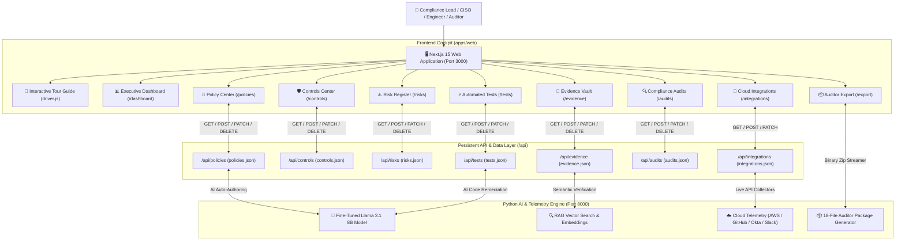
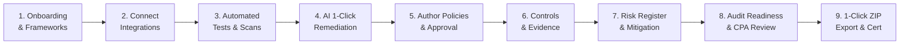

# AI-Compliance Platform: Master Product Overview, Architecture & End-to-End Operational Guide

**Document Version:** 2.0  
**Target Audience:** Compliance Officers, CISOs, DevOps Engineers, Leadership, and External CPA Auditors  
**Compliance Standards Covered:** SOC 2 Type II, ISO/IEC 27001:2022, NIST CSF v2.0, HIPAA Security, GDPR Privacy, and ISO 42001 (AI Governance)

---

## 1. Executive Summary & Core Value Proposition

**AI-Compliance** is a self-serve, autonomous Governance, Risk, and Compliance (GRC) platform. Traditional compliance audits require 6 to 12 months of manual consultant interviews, fragile spreadsheet trackers, and tedious screenshot collection. 

AI-Compliance replaces traditional friction with a **continuous, automated, AI-driven compliance engine**:

1. **Zero Third-Party LLM Data Leakage:** Powered by an air-gapped, local fine-tuned **Meta Llama 3.1 8B Instruct** model running entirely on sovereign infrastructure.
2. **100% Self-Serve UI (Zero Developer Dependency):** Every table, metric, policy, control, risk, and audit can be created, updated, uploaded, and deleted directly from the browser with zero code modifications.
3. **Autonomous Cloud Telemetry Harvesting:** Direct read-only connectors to AWS, Azure, Google Cloud, Okta, GitHub, Google Workspace, and Slack eliminate manual evidence gathering.
4. **153 Continuous Programmatic Tests:** Evaluates security posture 24/7 and generates instant 1-click **Terraform** and **AWS CLI** remediation code for failing controls.
5. **Scrut-Style Official PDF Artifacts:** Generates formal compliance policies and evidence dossiers styled with corporate letterheads, version history, and cryptographic sign-off seals.
6. **1-Click Auditor Package (.ZIP):** Packages 10 policies, 6 signed telemetry evidence JSONs, `MANIFEST.json`, and auditor `README.md` into an instant binary archive for CPA sign-off.
7. **Interactive Onboarding Guided Tour (`driver.js`):** Step-by-step contextual spotlight walkthrough guiding new users across every tab, drawer, and action button.

---

## 2. Product Architecture & Component Flow



---

## 3. End-to-End Operational Lifecycle: Step 1 to Last

Here is the complete step-by-step walkthrough of how any organization uses the platform from Day 1 to final CPA attestation:



---

### Step 1: Quick Onboarding & Framework Scoping
- **Route:** `http://localhost:3000/onboarding` & `/frameworks`
- **What Happens:**
  1. The user enters their company profile (e.g., *CloudSecure Enterprise*), primary cloud provider (*AWS*), and identity provider (*Okta*).
  2. Selects target compliance frameworks: **SOC 2 Type II**, **ISO/IEC 27001:2022**, and **NIST CSF v2.0**.
  3. Additional frameworks (such as **HIPAA**, **ISO 42001 AI Governance**, or **GDPR**) can be imported with 1 click under `/frameworks`.
  4. The platform initializes the compliance control baseline and sets up the live dashboard.

---

### Step 2: Connect Cloud & SaaS Integrations
- **Route:** `http://localhost:3000/integrations`
- **What Happens:**
  1. The compliance officer or DevOps engineer opens the Integrations catalog.
  2. Connects read-only access to infrastructure tools:
     - **Amazon Web Services (AWS):** Scans IAM policies, root MFA, S3 bucket encryption, CloudTrail logging, KMS keys, and VPC firewalls.
     - **GitHub:** Verifies repository branch protection, mandatory PR review count, and signed commits.
     - **Google Workspace / Okta:** Verifies 2-Step Verification (2SV), SSO enforcement, and automated de-provisioning SLAs.
     - **Slack:** Audits message retention and monitors `#incident-response` coordination channels.
  3. Supports both **Live API Mode** (real credentials) and **Sandbox Mode** (simulated cloud telemetry for dry-runs).
  4. Instant **"Test Connection"** validates OAuth/IAM tokens with latency benchmarks.

---

### Step 3: 24/7 Automated Security Tests & Continuous Monitoring
- **Route:** `http://localhost:3000/tests`
- **What Happens:**
  1. The engine executes **153 automated tests** across all connected cloud resources.
  2. Results are grouped by category (*Cloud Security, Identity & Access, Code & Change, Data Protection, Incident Management*).
  3. Each test reports real-time status:
     - `PASS` (Green): Verified compliant against framework controls.
     - `WARN` (Amber): Minor configuration drift requiring attention.
     - `FAIL` (Red): Control gap (e.g., *IAM Users Missing Hardware MFA* or *Unencrypted S3 Bucket*).
  4. Users can click **"Run All Tests"** to trigger a fresh enterprise-wide scan in real time.

---

### Step 4: 1-Click AI Auto-Remediation (Terraform & CLI)
- **Route:** `http://localhost:3000/tests` (Click "Resolve with AI" or failing test)
- **What Happens:**
  1. Clicking a failing test opens the **Interactive Remediation Terminal Drawer**.
  2. The local **Llama 3.1 8B** model synthesizes the exact fix:
     - **Terraform Tab:** Provides copy-paste ready Infrastructure-as-Code to fix the resource in code.
     - **AWS CLI Tab:** Provides an instant 1-line shell command to fix the issue immediately in the cloud console.
  3. Click **"Run Automated Cloud Patch"** to execute a 4-step autonomous remediation workflow.
  4. The test automatically re-scans and flips from `FAIL` to `PASS`.

---

### Step 5: Policy Authoring, Manual Upload & Approval Workflow
- **Route:** `http://localhost:3000/policies`
- **What Happens:**
  1. The Policy Center presents the 10 core corporate compliance policies.
  2. **Three Ways to Author/Update Policies:**
     - **AI Auto-Write:** Click *"AI Auto-Write Missing Policies"* to have fine-tuned Llama 3.1 author complete policies customized to your company and cloud stack.
     - **Manual Upload:** Click *"Upload Policy Document"* to drag-and-drop existing company files (`.pdf`, `.docx`, `.txt`, `.md`).
     - **In-UI Create & Edit:** Click *"+ Create Policy"* to define new custom policies, or click the *Edit (Pencil)* button on any row to change Title, Assignee, Approver, Dept, or Version.
  3. **Live Document Editor:** Click *"Inspect"* on any policy and click *"Edit Content"* to edit Markdown clauses directly in the browser and save.
  4. **3-Step Approval Stepper:**
     - **Step 1: Draft** (Authored or uploaded)
     - **Step 2: Needs Review / Approved** (CISO/Auditor sign-off)
     - **Step 3: Published** (Organization-wide formal attestation)

---

### Step 6: Controls Center & Evidence Mapping
- **Route:** `http://localhost:3000/controls`
- **What Happens:**
  1. Lists all mapped controls across SOC 2 (*CC6.1, CC6.6, CC7.2*), ISO 27001 (*A.9.1.1*), and NIST CSF (*PR.DS-1*).
  2. **Inspect & Edit Controls:**
     - Update control status (*Effective*, *Issue*, *Not Tested*).
     - Adjust maturity level score (*Level 1 to 5*).
     - Add auditor notes and remediation observations.
  3. **Evidence Mapping:** Attach or detach uploaded evidence documents, or click *Upload File* right inside the control drawer to attach instant proof.
  4. **Self-Serve Management:** Click *"+ Add Control"* to add custom internal controls, or click the *Trash* icon to delete obsolete controls.

---

### Step 7: Evidence Vault & AI Verification Analysis
- **Route:** `http://localhost:3000/evidence`
- **What Happens:**
  1. Central vault storing all machine telemetry snapshots and uploaded documents.
  2. **1-Click Telemetry Harvest:** Click *Collect AWS*, *Collect GitHub*, *Collect Google*, or *Collect Slack* to pull real-time signed JSON evidence.
  3. **RAG Semantic AI Verification:** Click *"Analyze with AI"* to run local embedding analysis:
     - Calculates an **AI Confidence Score** (e.g., 96% Compliant).
     - Pinpoints exact citations, page numbers, and highlighted clauses.
     - Identifies any remaining compliance gaps with specific recommendations.
  4. **Auditor Document Viewer:** Inspect, print, or download official cryptographic evidence dossiers.

---

### Step 8: Enterprise Risk Register & Mitigation Tracking
- **Route:** `http://localhost:3000/risks`
- **What Happens:**
  1. Tracks enterprise security and operational risks using a 5x5 Inherent vs. Residual matrix.
  2. **Create New Risks:** Click *"+ Add Risk"* and use interactive sliders for Likelihood (1-5) and Impact (1-5).
  3. **Inspect & Edit Treatment:** Update risk treatment (*Mitigated*, *Accepted*, *Transferred*, *Open*) and status (*Open*, *Mitigated*).
  4. **1-Click Export:** Download the entire Risk Register as an official **PDF Report** or **Markdown Document** for executive risk committees.

---

### Step 9: Audit Center & Common Criteria Review
- **Route:** `http://localhost:3000/audits`
- **What Happens:**
  1. Dedicated portal for lead compliance managers and external CPA auditors (e.g., *KPMG, BSI Group, PwC*).
  2. Tracks live audit readiness across **Common Criteria**:
     - `CC1.0`: Control Environment & Ethical Integrity
     - `CC2.0`: Communication & Information Governance
     - `CC3.0`: Risk Assessment & Objectives
     - `CC4.0`: Monitoring & Deficiency Evaluation
     - `CC5.0`: Control Activities & Mandates
     - `CC6.0`: Logical & Physical Access Security
  3. **Corrective Action Plans (CAP):** Create and track non-conformity remediation items with assignees, criticality levels, and due dates.
  4. **Create & Manage Audits:** Click *"+ New Audit"* to schedule internal or external audits, or edit existing observation periods.

---

### Step 10: 1-Click Auditor Package (.ZIP) & Executive Attestation
- **Route:** `http://localhost:3000/export` & `/reports`
- **What Happens:**
  1. The user navigates to the Export Center.
  2. Clicks **"Download Complete Auditor Package (.ZIP)"**:
     - The Python streaming engine compiles an instant binary `.zip` containing **18 verified artifacts**:
       - 10 Formal Markdown & PDF Compliance Policies
       - 6 Live Cloud Telemetry Evidence JSONs with SHA-256 digests
       - `MANIFEST.json` containing cryptographic hash ledgers
       - Auditor `README.md` with verification guide for external assessors
  3. Downloads the **Executive Audit Readiness Dossier (.PDF)**.
  4. The external CPA auditor inspects the packaged evidence and certifies clean compliance attestation.

---

## 4. Self-Serve UI vs. Developer Lineage Summary

Every piece of data on the platform is maintained through a transparent 3-tier structure:

```
[apps/web/data/<entity>.json]  <--- Local persistent database store
             ↕
[apps/web/src/app/api/<entity>/route.ts]  <--- Full REST CRUD (GET, POST, PATCH, DELETE)
             ↕
[apps/web/src/app/<entity>/page.tsx]  <--- Interactive UI (Create, Edit, Upload, Delete)
```

| Section | UI Page | REST API Route | Persistent Data File | In-UI Actions Available |
| :--- | :--- | :--- | :--- | :--- |
| **Policies** | `/policies` | `/api/policies` | `apps/web/data/policies.json` | Create, Edit, Inline Markdown Edit, AI Write, Upload, Delete, Approve, Publish |
| **Controls** | `/controls` | `/api/controls` | `apps/web/data/controls.json` | Add Control, Edit Status/Maturity/Notes, Attach Evidence, Upload File, Delete |
| **Risks** | `/risks` | `/api/risks` | `apps/web/data/risks.json` | Add Risk, 5x5 Sliders, Edit Treatment/Status, Delete, Export PDF/MD |
| **Evidence** | `/evidence` | `/api/evidence` | `apps/web/data/evidence.json` | Upload Document, Collect Telemetry, AI Analyze, Edit Status, Delete |
| **Automated Tests** | `/tests` | `/api/tests` | `apps/web/data/tests.json` | Run Test, Run All, AI Auto-Remediate, Copy Terraform/CLI, Delete |
| **Audits** | `/audits` | `/api/audits` | `apps/web/data/audits.json` | Create Audit, Edit Scope/Dates/Readiness, Add Non-Conformities, Delete |
| **Integrations** | `/integrations` | `/api/integrations` | `apps/web/data/integrations.json` | Connect, Disconnect, Switch Live/Sandbox, Set API Keys, Test Connection |
| **Frameworks** | `/frameworks` | `/api/frameworks` | `apps/web/data/frameworks.json` | Import SOC 2, ISO 27001, NIST CSF, HIPAA, ISO 42001, GDPR |

---

## 5. Technology Stack Summary

| Layer | Technology | Purpose |
| :--- | :--- | :--- |
| **Frontend Web App** | Next.js 15, React 19, Tailwind CSS, Lucide | High-performance compliance cockpit, interactive drawers, driver.js tour, live editors |
| **API & Enterprise Layer** | Next.js App Router API Routes, TypeScript | REST CRUD APIs, local JSON server store, instant mutation persistence |
| **Local AI Service** | Python 3.11+, FastAPI, Uvicorn (Port 8000) | Local fine-tuned LLM inference, RAG embeddings, cloud collectors, binary ZIP export |
| **Open-Source LLM** | Meta Llama 3.1 8B Instruct (Fine-Tuned GRC) | Host-local policy authoring, automated remediation code, zero data leaks |
| **Guided Tour** | Driver.js | Interactive multi-tab guided walkthrough spotlights across all UI components |
| **Document Engine** | Client-Side PDF-1.4 Generator (`pdfGenerator.ts`) | Generates genuine binary `.pdf` documents and print layouts directly in the browser |

---

## 6. Local Server Endpoints & Port Reference

- **Compliance Web Application:** `http://localhost:3000`
- **Dashboard:** `http://localhost:3000/dashboard`
- **Policy Center:** `http://localhost:3000/policies`
- **Controls Center:** `http://localhost:3000/controls`
- **Automated Tests:** `http://localhost:3000/tests`
- **Integrations:** `http://localhost:3000/integrations`
- **Evidence Vault:** `http://localhost:3000/evidence`
- **Risk Register:** `http://localhost:3000/risks`
- **Compliance Audits:** `http://localhost:3000/audits`
- **Auditor Package Export (.ZIP):** `http://localhost:3000/export`
- **FastAPI AI Docs & Swagger:** `http://localhost:8000/docs`
